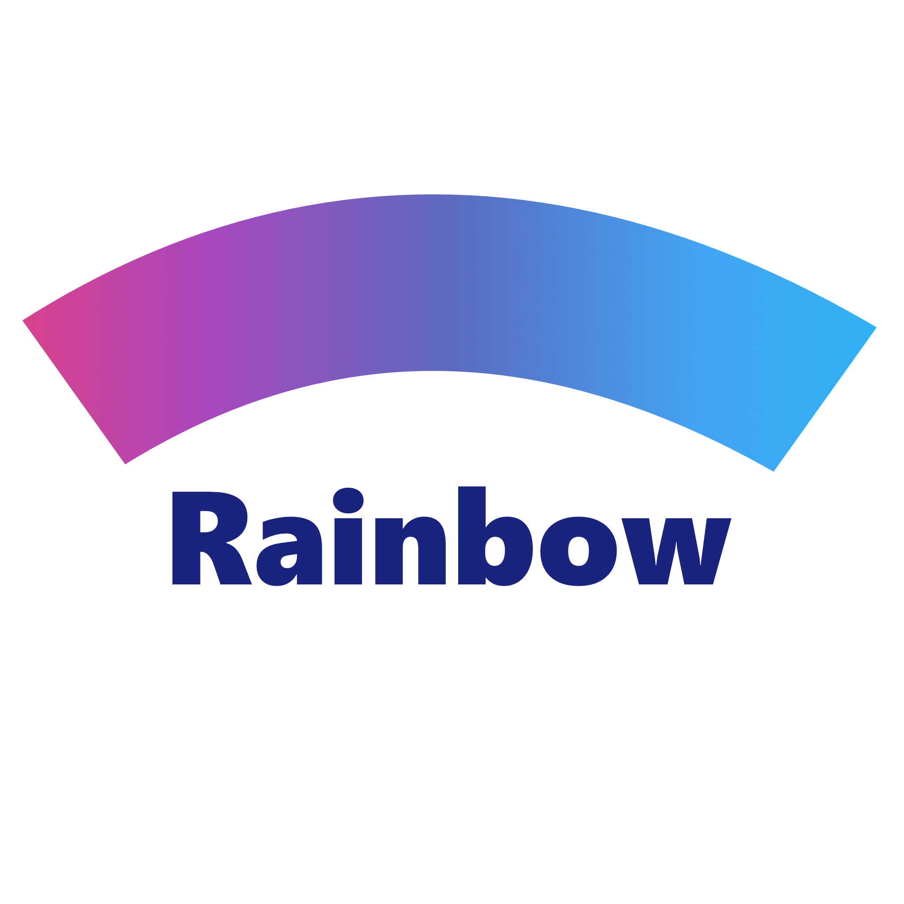

<p align="center" >
	
</p>

<p align="center">
	<a href="https://http://www.android.com">
		
	</a>
	<a href="https://jitpack.io/#julialoseva/Rainbow">
		
	</a>
	<a href="https://tldrlegal.com/license/apache-license-2.0-(apache-2.0)">
		
	</a>
</p>

## At a Glance

`Rainbow` gives you set of colors listed in [Google Material](https://material.io/design/color/the-color-system.html#color-theme-creation) guidelines. With `Rainbow` you can pick a color from ready collection instead of copying hexademical values into your `colors.xml`.

## How to Get Started

Add `jitpack.io` repository to your project:

```javascript
allprojects {
 repositories {
    jcenter()
    maven { url "https://jitpack.io" }
 }
}
```

Then add `Rainbow` to dependencies list:

```javascript
dependencies {
    implementation 'com.github.julialoseva:Rainbow:1.2'
}
```

## Requirements

* Android SDK 15 and later
* Android Studio 3.0 and later
* Java 7 and later

## Usage

`Rainbow` provides you with full list of [Material colors](https://material.io/design/color/the-color-system.html#color-theme-creation). Simply type `@color/rb_<name>_<level>` to get a color:

```xml
<TextView
          android:text="This is a text view."
          android:background="@color/rb_gray_900"
          android:textColor="@color/rb_pink_300"
          />
```

## License

`Rainbow` is available under the MIT license. See the [LICENSE](./LICENSE) file for more info.
